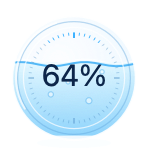
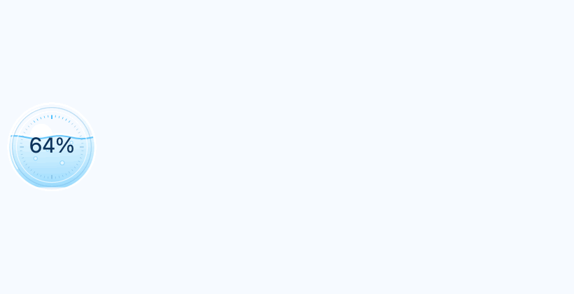
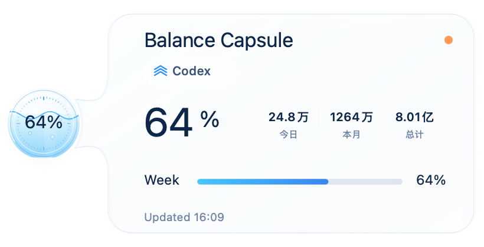

# Balance Capsule

一款精致、轻量、常驻桌面的 AI Agent 配额悬浮球。无需打开设置页，即可查看 Codex 与 Claude Code 的额度和刷新状态。


> Balance Capsule 目前仅支持 Codex 与 Claude Code。

## 下载

前往 [Releases](https://github.com/Cchenshufen/Balance-Capsule/releases) 下载对应平台版本：

| 平台 | 系统要求 | 下载文件 |
| --- | --- | --- |
| macOS | macOS 26 或更高版本，仅 Apple Silicon | 在 Releases 中下载 DMG |
| Windows | 仅 Windows 11 x64 | 在 Releases 中下载 EXE |

同时提供 macOS ZIP 和 Windows 便携 ZIP。请使用 Release 中的 `SHA256SUMS.txt` 校验下载文件。

## 界面预览

### 常驻悬浮球

<p align="center"></p>

### 液态悬停动画

<p align="center"></p>

### 液态玻璃详情面板

<p align="center"></p>

## 视觉与交互效果

- 78px 常驻液态玻璃悬浮球，支持自由拖动与屏幕边缘吸附。
- 鼠标滑入悬浮球自动展开详情，无需点击。
- 球体与详情面板通过连续液滴颈部自然衔接，包含液面摆动、气泡、刻度、扫光与柔和阴影。
- macOS 使用 AppKit 实时绘制；Windows 使用 WPF 矢量、Acrylic 模糊与实时动画。
- 所有主要界面均由代码生成，不使用效果图贴图代替交互界面。
- 双击悬浮球立即刷新；右键菜单和系统托盘也可刷新、切换数据源或隐藏悬浮球。

## 功能介绍

- 显示 Codex 或 Claude Code 当前官方配额和刷新状态。
- Codex 显示当前账号的今日、本月、总计 Token 使用量，单位自动转换为“万 / 亿”。
- 按官方接口返回的真实窗口显示周额度，不虚构已经缺失的 5 小时额度。
- Codex 与 Claude Code 数据独立读取，不混用账号或 Token 统计。
- 默认每 60 秒刷新；支持双击、右键菜单和托盘菜单立即刷新。
- 支持开机启动、显示/隐藏悬浮球、切换数据来源和退出应用。
- 单实例运行，重复启动不会创建第二个悬浮球。

## 使用方式

### macOS

1. 从 Releases 下载并打开最新的 macOS DMG。
2. 将 **Balance Capsule** 拖入 Applications。
3. 首次启动时，在 Finder 中右键应用并选择“打开”。本地发布包使用 ad-hoc 签名，未进行 Apple Developer ID 公证。
4. 保持 Codex 或 Claude Code 已登录；将鼠标滑到悬浮球上查看详情。

### Windows

1. 从 Releases 下载并运行最新的 Windows x64 EXE，无需安装 .NET。
2. 若安全软件阻止单文件启动，可改用便携 ZIP，完整解压后运行其中的 `BalanceCapsule.exe`。
3. 当前版本未使用商业代码签名。若 SmartScreen 提示未知发布者，请核对来源和 SHA-256 后选择“更多信息”继续运行。
4. 保持 Codex 或 Claude Code 已登录；将鼠标滑到悬浮球上查看详情。

### 通用操作

- 拖动：按住悬浮球移动位置。
- 查看详情：鼠标进入悬浮球后自动展开，移出后收起。
- 刷新：双击悬浮球，或在右键/托盘菜单选择“立即刷新”。
- 切换来源：在“数据来源”中选择 Codex 或 Claude Code。
- 隐藏/显示：托盘菜单会根据当前状态显示“隐藏悬浮球”或“显示悬浮球”。

## 工作原理

Codex 官方账号模式会在本机定位受信任的 Codex CLI 或桌面运行时，以 `app-server` 模式通过标准输入输出调用只读 RPC：

- `account/rateLimits/read`：读取官方配额窗口。
- `account/usage/read`：读取当前登录账号的 Token 使用统计。

Claude Code 模式通过官方 `statusLine` 数据读取其返回的额度信息，只保存百分比、重置时间和采集时间。个人 Claude Code 账号没有与 Codex 等价的官方账号 Token 汇总接口，因此不会使用本机会话日志估算或冒充官方总量。

## 隐私与安全

- 不读取或上传聊天正文、会话日志、浏览器 Cookie、浏览器登录状态或 Codex `auth.json`。
- 不读取 Claude 会话正文或 OAuth 登录令牌。
- 不包含遥测、广告、用户画像或分析 SDK。
- 本地仅保存悬浮球位置、选中数据源、显示状态和开机启动等非敏感设置。
- 不安装系统服务、驱动、根证书或浏览器扩展。

## 系统要求

### macOS

- macOS 26 或更高版本。
- Apple Silicon：M1、M2、M3、M4 或后续 arm64 芯片。
- 不支持 Intel Mac。

### Windows

- Windows 11（build 22000）或更高版本。
- x64 处理器。
- 自包含 .NET 8 运行时，无需另外安装 .NET SDK。
- 不支持 Windows ARM 原生运行。

## 从源码构建

macOS：

```bash
chmod +x scripts/build-macos.sh
scripts/build-macos.sh
```

Windows：

```bash
scripts/build-windows.sh
```

构建产物位于 `artifacts/`。Windows 构建需要可用的 .NET 8 SDK；macOS 构建需要 Xcode Command Line Tools。

## 免责声明与许可

额度信息以对应服务实际返回为准。本仓库当前未附加开源许可证；除非项目所有者另行授权，默认版权规则仍然适用。
